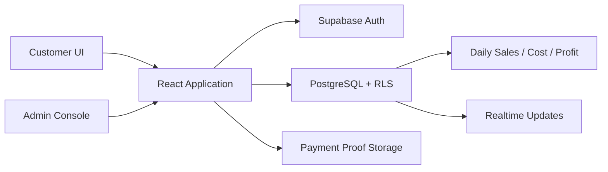

# UTM-KS Ordering Platform

一个面向校园与小型餐饮场景的全栈订餐系统，覆盖用户注册、菜单浏览、选餐下单、二维码支付、付款凭证上传、订单履约和经营数据统计。前端使用 React + TypeScript，Supabase 提供认证、PostgreSQL、Storage、Realtime 与权限控制。

> React 19 · TypeScript · Supabase · PostgreSQL · Vite

## Highlights

- 用户与管理员双角色流程，管理员通过内部白名单授权。
- 菜单、价格、配送点、订单、付款凭证和每日经营统计统一管理。
- 支付宝/微信静态码支付与付款截图上传。
- Supabase Auth、RLS、RPC 和 Storage policy 组成后端安全边界。
- 支持订单与登录状态实时同步、过期付款凭证清理和汇率更新。
- 完整的生产构建、环境变量模板与部署说明。

## Architecture



## Core Modules

- 顾客端：注册、登录、今日菜单、配送点、下单、支付和订单查询。
- 管理端：订单台、付款核验、菜单维护、用户管理、系统配置和日报。
- 数据层：用户资料、管理员白名单、菜单、订单、订单行、支付和每日统计。
- 安全：RLS、服务端函数、签名下载链接和环境变量隔离。

## Local Development

```bash
npm install
cp .env.example .env
npm run dev
```

在 `.env` 中配置：

```env
VITE_SUPABASE_URL=https://your-project.supabase.co
VITE_SUPABASE_ANON_KEY=your-anon-key
```

将 [`supabase/schema.sql`](supabase/schema.sql) 应用到自己的 Supabase 项目后再创建内部管理员账号。不要在公开环境中使用示例邮箱或弱密码。

## Validation

```bash
npm run lint
npm run build
```

## Repository Structure

```text
src/components/   通用 UI 组件
src/views/        顾客端与管理端页面
src/lib/          Supabase API、认证和业务工具
supabase/         Schema、RLS、RPC 与 Storage policy
docs/             上线与运维说明
scripts/          开发、构建和预览入口
```

更多上线细节见 [`docs/launch-plan.md`](docs/launch-plan.md)。
